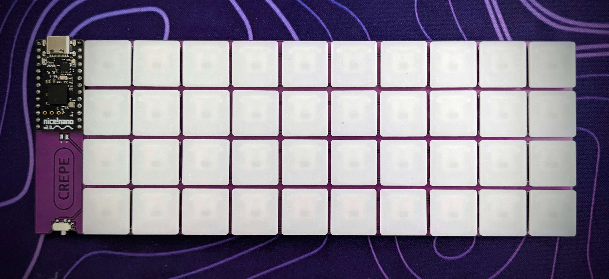

# CREPE

## 40% ultrathin ortholinear keyboard

 

## MATERIALS
- 40x [Kailh X Switches](https://mkultra.click/kailh-x-switches-and-keycaps/)
- 40x [1N4148 - SOD-123 Diodes](https://mkultra.click/diode-1n4148-sod-123f/)
- 1x ProMicro style Microrocontroller (ProMicro, Nice!Nano, EliteC, STeMCell, etc)
- 1x [Power Switch](https://mkultra.click/alps-ssss811101/) (optional)
- 1x Battery (optional)

## FIRMWARE

[QMK](https://github.com/jasonhazel/qmk_hazel/tree/master/keyboards/jasonhazel/crepe)

[ZMK](https://github.com/jasonhazel/zmk-config/tree/master/config/boards/shields/crepe)

## SUPPORT

<a property="dct:title" rel="cc:attributionURL" href="https://github.com/jasonhazel/crepe">CREPE</a> by <a rel="cc:attributionURL dct:creator" property="cc:attributionName" href="https://github.com/jasonhazel">Jason Hazel</a> is licensed under <a href="http://creativecommons.org/licenses/by/4.0/?ref=chooser-v1" target="_blank" rel="license noopener noreferrer" style="display:inline-block;">CC BY 4.0</a>
